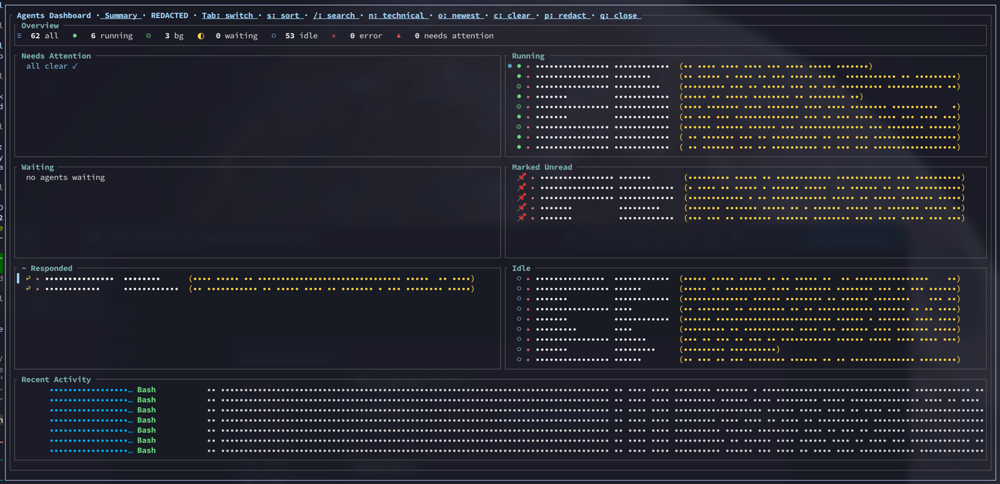

# tmux-agent-dashboard

A tmux popup dashboard for Claude Code / Codex / OpenCode / Grok agents. Shows
aggregate counters, attention / waiting / responded lists on the left,
running / idle lists on the right, and a global recent-activity feed at
the bottom. Also includes a tiles grid view for a quick visual overview.

<p align="center">
  
</p>

A phone companion app lives at
[tmux-agent-companion](https://github.com/kaiiserni/tmux-agent-companion) - read,
approve and reply to your agents from your phone.

## Agent hooks

Agents call `tmux-agent-dashboard hook <agent> <event>`, which writes the
`@pane_*` state the TUI reads. Generate that config from the adapters:

```bash
tmux-agent-dashboard install-hooks claude          # print, review, merge yourself
tmux-agent-dashboard install-hooks claude --write  # merge into ~/.claude/settings.json (backs up, keeps other hooks)
tmux-agent-dashboard install-hooks codex  --write  # ~/.codex/hooks.json
tmux-agent-dashboard install-hooks grok   --write  # ~/.grok/hooks/tmux-agent-dashboard.json
```

`claude`, `codex`, `antigravity`, `pi`, `grok`. Panes without `@pane_agent` are
detected via a process-tree scan (`@dashboard_detect_fallback`, default on).

Grok Build scans `~/.claude/settings.json` for hooks by default, so a grok pane
can end up tagged `claude`. Disable that in `~/.grok/config.toml`:

```toml
[compat.claude]
hooks = false
```

## Install

### TPM (build from source)

```tmux
set -g @plugin 'kaiiserni/tmux-agent-dashboard'
```

After `prefix + I`, run `cargo build --release` inside the plugin
directory so the binary lands in `target/release/`.

### Manual

```bash
git clone https://github.com/kaiiserni/tmux-agent-dashboard.git \
  ~/projects/tmux-agent-dashboard
cd ~/projects/tmux-agent-dashboard
cargo build --release
```

In `~/.tmux.conf`:

```tmux
run-shell '~/projects/tmux-agent-dashboard/tmux-agent-dashboard.tmux'
```

## Keybindings

Open the dashboard with `prefix + ñ`. These keys work in any tab:

| Key | Action |
|---|---|
| `Tab` | Cycle Tiles / Summary / Overview |
| `s` | Toggle attention-first sort |
| `n` | Toggle technical names (repo + branch vs friendly name) |
| `o` | Toggle Responded order (oldest-first review queue vs newest-first) |
| `p` | Toggle redact mode (hide ages/timestamps + mask text, for screenshots) |
| `Space` | Jump to the top pane that needs attention and close |
| `L` | Jump back to the origin pane (toggles back on a second press) |
| `Enter` or click | Activate the selected pane and close |
| `q` / `Esc` / right-click | Close |

Move around inside a view:

| Key | Action |
|---|---|
| `j` / `k` / `↓` / `↑` | Move the selection |
| `h` / `l` / `←` / `→` | Between columns (Summary) or groups (Tiles) |
| `g` / `G` | First / last (Summary, Overview) |
| `PageDown` / `PageUp` | Scroll the active list |
| `Ctrl+d` / `Ctrl+u` | Half-page scroll (Overview) |
| Mouse wheel | Scroll the list under the cursor |

Act on the selected pane:

| Key | Action |
|---|---|
| `m` | Toggle marked-unread (Tiles, Summary) |
| `c` | Clear a stuck pending state: attention, status, wait-reason and mark (Tiles, Summary) |

The Tiles view adds `f` / `z` to cycle folding (one group open, all closed, all open), `d` / `u` to step between groups, and `a` to hide idle panes.

`/` opens a live filter in any tab: type to narrow, `↑` / `↓` or `Ctrl-j` /
`Ctrl-k` to move, `Enter` to jump, `Esc` to clear and exit. In Tiles and
Summary it matches pane names (repo, branch, session) with the strict
substring/acronym rule; in Overview it filters projects/idle entries with a
looser subsequence match over their full text.

The header items are clickable too: clicking one runs the matching key (and clicking the tab label or `Tab: switch` flips the view).

Each tile in the Tiles view also shows a context-preview line: the pane's
most recent activity-log entry (tool, label, and age). Hidden in redact mode.

### Jump picker

The `jump` subcommand opens a small popup over the pending agents so you
can hop to one without the full dashboard. Bind it to a key, e.g.:

```tmux
bind -N "agents: jump picker" n display-popup -E -w 76 -h 18 \
  '~/projects/tmux-agent-dashboard/bin/tmux-agent-dashboard jump'
# open straight on the Search tab:
bind -N "agents: search" a display-popup -E -w 76 -h 18 \
  '~/projects/tmux-agent-dashboard/bin/tmux-agent-dashboard jump search'
```

The popup has two tabs. The **Jump** tab numbers the first nine pending
panes (1-9), matching the status bar, with a short countdown: leave it
alone and it jumps to the most urgent pane (the plain `next` behaviour);
press a number, or navigate and confirm, to pick another. The first
navigation key cancels the countdown.

`s`, `/` or `Tab` switches to the **Search** tab — a fuzzy filter over
*every* agent pane across all sessions (match on repo, branch, session or
agent), not just the pending ones. It is vim-modal: you arrive in insert
mode (type to filter); `Esc` drops to normal mode (`j`/`k` to move). `Tab`
cycles the modes (Jump → insert → normal → Jump). When the popup is opened
straight on the Search tab (the `jump search` bind), `Esc` from normal mode
closes it instead of falling back to the Jump tab.

Jump tab:

| Key | Action |
|---|---|
| `1`-`9` | Jump to that numbered pane |
| `j` / `k` / `↓` / `↑` | Move selection (cancels the countdown) |
| `g` / `G` | First / last |
| `Enter` | Jump to the highlighted pane |
| `n` | Jump to the most urgent pane now |
| `s` / `/` / `Tab` | Switch to the Search tab |
| `q` / `Esc` | Close |

Search tab:

| Key | Action |
|---|---|
| _type_ | Filter (insert mode) |
| `Backspace` | Delete a query char |
| `↑` / `↓`, `Ctrl-n` / `Ctrl-p`, `Ctrl-j` / `Ctrl-k` | Move selection (insert mode) |
| `j` / `k`, `g` / `G` | Move selection (normal mode) |
| `s` | Toggle ordering: newest activity ↔ alphabetical (normal mode) |
| `Esc` | Insert → normal mode; normal → Jump tab (or close if opened on Search) |
| `Tab` | Insert → normal → Jump tab (cycle) |
| `i` / `/` | Re-enter insert mode (normal mode) |
| `Enter` | Jump to the highlighted pane |

The Search list is ordered newest-activity-first by default; `s` toggles
alphabetical. The footer shows the current order (`[recent]` / `[a-z]`).

A single pending pane skips the popup and jumps straight there. The
countdown defaults to 250ms (`@dashboard_jump_timeout_ms`); set it to `0`
to wait for a key instead.

## Configuration

```tmux
set -g @dashboard_key    'ñ'      # default
set -g @dashboard_width  '90%'    # default
set -g @dashboard_height '85%'    # default

set -g @dashboard_jump_timeout_ms '250'  # jump-picker countdown (ms); 0 = wait for a key
```

The sidebar's `@sidebar_color_*` and `@sidebar_icon_*` options are
reused so visual customisation carries over.

## Overview tab

The third tab ("Overview") renders a prioritised, per-project briefing from an
external JSON file. The dashboard is a **pure consumer** with no built-in
producer. Point it at a file and it polls that file on every refresh:

```tmux
set -g @dashboard_overview_file '~/.local/state/agent-overview/overview.json'
```

Unset → the tab shows a setup hint. Any tool can produce the file; the
[`agent-overview`](https://github.com/kaiiserni/agent-overview) job is one.
Rows are clickable (mouse) and navigable (`j`/`k` select, `Enter` jumps to the
pane → window → session; `Ctrl+D`/`Ctrl+U` half-page scroll). Clicking falls
back to the session/window when the pane id is gone.

### File schema

UTF-8 JSON, rewritten in place each update. `updated_at` is epoch seconds; all
strings are plain text.

```json
{
  "updated_at": 1781330413,
  "tldr": ["short bullets for the header"],
  "projects": [
    {
      "name": "my-project",
      "cwd": "/abs/path/to/project",
      "attention": true,
      "doing": "what's happening right now",
      "needs_from_you": "blocker text, or empty string",
      "next_steps": ["suggestion 1", "suggestion 2"],
      "active_md": ["optional verbatim notes"],
      "panes": [
        {
          "pane_id": "%123",
          "target": "session:window.pane",
          "agent": "claude",
          "status": "running",
          "age_minutes": 12,
          "summary": "one-line of what this pane is doing"
        }
      ]
    }
  ],
  "idle": [
    { "pane_id": "%99", "target": "session:window.pane", "project": "name", "task": "what it was doing" }
  ]
}
```

Field notes: `attention: true` sorts a project to the top and flags it. `pane_id`
(`%N`) is the tmux pane id used for click/Enter navigation; `target` is the
`session:window.pane` fallback. Unknown extra fields are ignored, so producers
can add their own.

## Notifications

A background daemon can push a Google Chat message whenever a pane
transitions into an attention-worthy state (an explicit attention flag,
or status Waiting / Error), handy when you work remotely over
mosh/ssh and don't want to keep opening the popup.

1. In Google Chat, open the target space → space name → **Apps &
   integrations** → **Webhooks** → **Add webhook**, and copy the URL.
2. Point the dashboard at it:

   ```tmux
   set -g @dashboard_notify_webhook 'https://chat.googleapis.com/v1/spaces/AAAA/messages?key=...&token=...'
   ```

   (Or export `DASHBOARD_NOTIFY_WEBHOOK` in the environment as a
   fallback.)

When `@dashboard_notify_webhook` is set, the plugin auto-starts the
daemon on load (guarded against duplicate instances via
`/tmp/tmux-agent-dashboard-notify.pid`). It polls every ~5s and applies
a 60s per-pane cooldown so a flapping pane won't spam the space.

Run it standalone:

```bash
tmux-agent-dashboard notify-daemon
```

Messages look like `⚠ auth refactor (cc-helion:editor) — waiting · …`,
using the friendly pane name when set. Activity is appended to
`/tmp/tmux-agent-dashboard-notify.log` (start/stop and sent
notifications; the webhook URL is never logged). With no webhook
configured the daemon exits with a message on stderr.

## Architecture

- `prefix + ñ` triggers `tmux display-popup -E "<bin>"` which runs the
  Rust TUI
- The TUI reads `tmux list-panes -F` for pane state and
  `/tmp/tmux-agent-activity*.log` for the recent activity feed
- `seen <pane_id>` (bound to `after-select-pane`) writes
  `@pane_last_seen_at` so the dashboard can derive when you last
  looked at a pane, the basis for the Responded heuristic. It also
  forces a status-line redraw so a pane that just became seen drops off
  the pending bar at once instead of lingering until the next
  `status-interval` tick

### Pane state contract (`@pane_*`)

The dashboard is a consumer of per-pane tmux options written by the
[`tmux-agent-sidebar`](https://github.com/hiroppy/tmux-agent-sidebar) hooks
(except `@pane_last_seen_at`/`@dashboard_marked_unread_at`, which this binary
writes itself, and `@pane_summary`, which an external producer like
`agent-overview` writes). This is the shared contract; any reader (this TUI,
the `agent-overview` job) reads the same options:

| Option | Meaning |
|---|---|
| `@pane_agent` | agent kind (`claude`/`codex`/`opencode`/`antigravity`/`pi`/`grok`); a pane is only an "agent pane" when set |
| `@pane_status` | `running` / `waiting` / `idle` / `background` / `error` |
| `@pane_attention` | set when the agent flagged it needs the developer |
| `@pane_cwd` | working directory |
| `@pane_prompt` (+ `@pane_prompt_source`) | the task prompt the agent is running |
| `@pane_wait_reason` | what a `waiting` pane is blocked on |
| `@pane_permission_mode` | Claude permission mode (`default`/`plan`/`acceptEdits`/`auto`/…) |
| `@pane_started_at` / `@pane_last_seen_at` | epoch seconds: pane start / last user focus |
| `@pane_session_id` | Claude session id (resolves a friendly session name) |
| `@pane_worktree_name` / `@pane_worktree_branch` | git worktree context |
| `@pane_summary` | one-line LLM summary of what the pane is doing now (external producer; may lag) |

Plus `/tmp/tmux-agent-activity_<N>.log` lines (`epoch|tool|label`) for the
recent-activity feed.

## Build from source

macOS (arm64):

```bash
cd ~/projects/tmux-agent-dashboard
cargo build --release
cp target/release/tmux-agent-dashboard bin/
codesign --force --sign - bin/tmux-agent-dashboard
```

Linux: `cargo build --release` is enough; no codesigning needed.

## License

MIT
